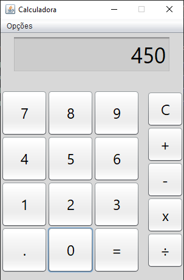
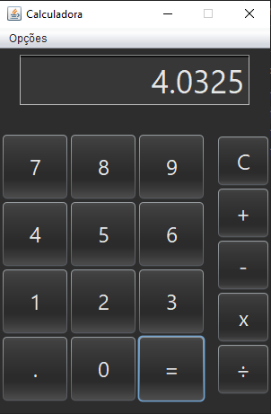

# Calculadora em java
Esta calculadora foi criada como um mini projeto de calculadora com funções básicas para fixação de conhecimentos utilizando Swing no Java e de manipulação de arquivo de extensão .properties para realizar o salvamento e carregamento de uma opção no aplicativo.

## Visualização
 
